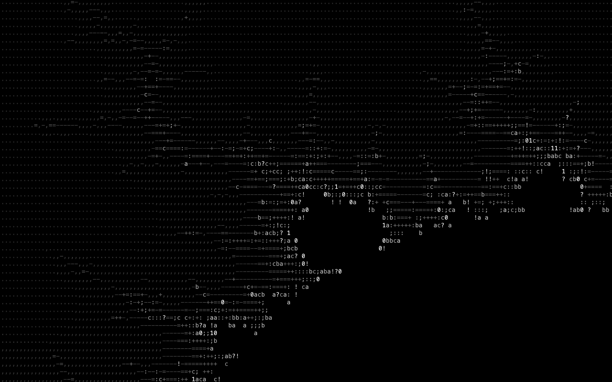

# Overview

This is a small terminal-based renderer using [ncurses](https://en.wikipedia.org/wiki/Ncurses) to render the [Mandelbrot](https://en.wikipedia.org/wiki/Mandelbrot_set) set in a standard terminal. By using your mouse you can zoom into more interesting areas, use `z` to zoom out again and `q` to quit.

## Build

You need to have a correctly defined `JAVA_HOME` environment as well as the development libraries for ncurses and build essentials for C development. On mac, these can be installed via Homebrew using

    brew install ncurses

Afterwards, a

    mvn clean package

should suffice.

Note that I only tested the build scripts on a mac. 

## Run

After a successful build, execute

    java -Djava.library.path=target -jar target/main-1.0-SNAPSHOT.jar

## Design Remarks

While implementing this small application, I strived to prevent over engineering, i.e. not adding code for future improvements (which won't come anyway) by using fancy design patterns, single implementation interfaces, etc.. To keep the overall structure understanadble I also tried to keep the average lines of code per file at around 50.

I've also implemented a parallelized computation of the Mandelbrot set, but even with the smallest terminal font of around 4 pixel, the computation is very fast and time-to-final-image is basically completely based on rendering time which is very, very slow.
